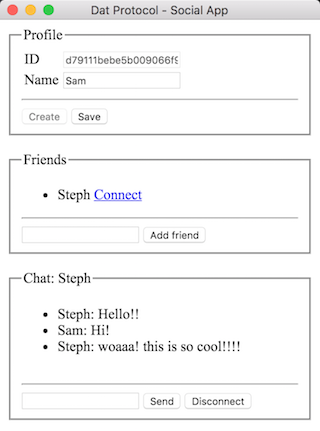

# Dat Social Chat

A small prototype P2P chat application built using [Electron](https://electronjs.org/) and [Dat](https://datproject.org/).



## Install
```bash
npm install # or yarn
npm start
```

## Peer profiles using Dat

Dat is peer to peer (p2p) protocol for building distributed apps. [Hyperdrive](https://github.com/mafintosh/hyperdrive), built ontop of Dat, provides a distributed file system which peers use to upload their profile to peers.

A hyperdrive archive provides its own public key which peers can use to find each other. It's a 64-character hex encoded string (e.g. `'1899b1f0a006cd0419545cb13c7f2ddc46c650e9512213a0899e5947a6a4d819'`). This means peers are hidden by default unless they distribute their public key.

### profile.json

This file exists in a peer's hyperdrive archive as a way to provide public information about a peer. In this case, a peer's name.

```json
{
    "name": "Sam"
}
```

This file is downloaded by peers to display a more friendly name.

### friends.json

Each peer maintains a list of their friend keys. Currently this is only used locally.

## Chatting with WebRTC

To chat with peers, a WebRTC data channel connection is created to provide low latency, encrypted communication.

### Connection overview

Each local peer creates a network swarm, using [discovery-swarm](https://github.com/mafintosh/discovery-swarm), which acts as a lobby for other peers to initiate a connection. A simple challenge-response authentication process is used to verify each peer's identity. Following authentication, peers perform WebRTC signalling to create a WebRTC connection.

### Authentication

When a peer wants to connect to another peer, they need to verify each others' identity so they can be sure they're talking to the right person. This is accomplished using elliptic-curve cryptography via [libsodium](https://libsodium.org).

Each peer's hyperdrive key pair is [converted from Ed25519 to Curve25519](https://download.libsodium.org/doc/advanced/ed25519-curve25519.html) to perform authenticated encryption.

_See [network.js](network.js) for implementation._

#### Peer (Bob) connecting to host (Alice)

When Bob wants to connect to Alice, Bob will know Alice's public key ahead of time.

1. Bob sends his public key to Alice encrypted with her public key.
1. Alice uses her private key to decrypt Bob's public key. Alice [creates a shared key](https://download.libsodium.org/doc/key_exchange/#purpose) using Bob's public key and her private key to send an encrypted nonce to Bob.
1. Bob creates his own shared key using Alice's public key and his private key. Bob uses the shared key to decrypt the nonce and send it back encrypted.
1. Alice decrypts the nonce with the shared key and verifies it's the same nonce originally sent. Alice sends an authentication success message to Bob.

Following authentication, Bob performs WebRTC signalling  over the same connection using the [steps defined in the Simple Peer library](https://github.com/feross/simple-peer#data-channels).